<!--
  Profile README for github.com/jcbarandon. The portrait (width 370) and info
  card (width 490) sit in a table so they render at the same height. If you
  change the info card's H, re-match these widths.
-->

<table>
<tr>
<td valign="top"></td>
<td valign="top"></td>
</tr>
</table>

## Joe Barandon

**Software Engineer · Machine Learning Engineer · Applications Developer**

 

<!-- animated contribution graph, refreshed daily by the workflow -->

